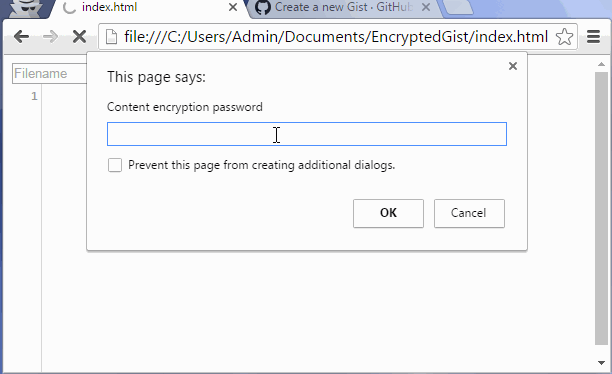

EncryptedGist
=============

Client-side encrypted plaintext editor that can persist/sync with GitHub Gists. All text is synchronized in an [encrypted](http://bitwiseshiftleft.github.io/sjcl/) state. I had a similar use case to [SDEES](https://news.ycombinator.com/item?id=12441302) ([Code on GitHub](https://github.com/schollz/sdees)), but needed a zero-install, browser-based solution.

[Try it!](https://srpeck.github.io/encryptedgist/index.html)

The editor is customized to my personal usage - CodeMirror in Vim mode for pure plaintext notetaking across multiple fixed-configuration machines (VDI, etc.). Often this includes confidential notes that I do not want to share with Google/Microsoft/GitHub, hence SJCL client-side encryption. Depending on your usage, you may want to inline everything in a single HTML file and/or add localStorage for offline/single-machine use, similar to [Encrypted](https://github.com/srpeck/encrypted).

Currently file filename field is locked first, because the script only loads the main gist file.
You can save it under any name , but remember it will always open your "main" file.

improved version:

* uses 256 bit encryption now

* has emacs and sublime keybindings 

* uses localstorage for token and gist id

* indicates that you "read -then-write" in the button

* has clear buttons for all stored things

## Be sure to use a github acces token , basic auth is still supported , but only with token ( PATCH  gives 404 with regular password etc. https://stackoverflow.com/questions/34477537/github-gist-api-patch-doesnt-work )

MIT License

## credits

#### [random backgrounds from this example](https://codepen.io/omascaros/pen/LYeppN)
#### [random background sources idea from awik.io](https://awik.io/generate-random-images-unsplash-without-using-api/)